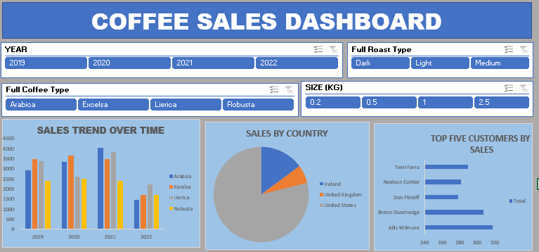

Coffee-Sales-Analysis-with-Excel-New This project is to analyze the dataset from a Coffee Sales shop and also create a dashboard that allows the management of the company to visualize
Sales trend overtime  Sales by country Top 5 customers
Filter by key metrics and interact with dynamic slicers and timelines. Using Excel.

